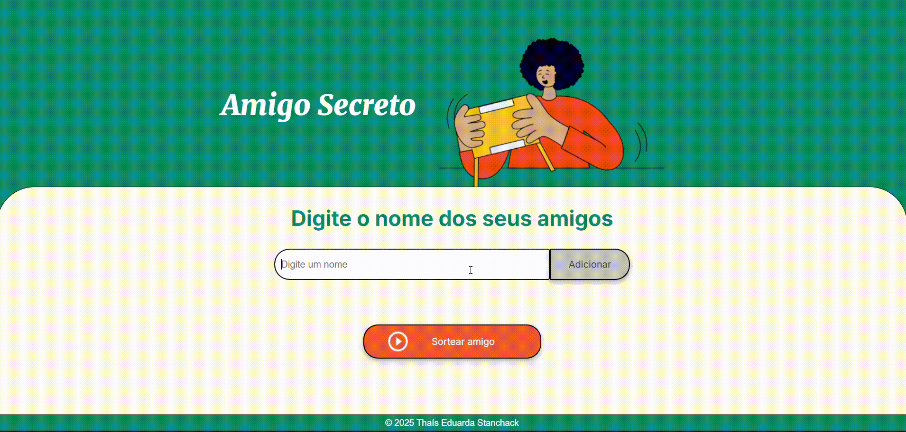

# AMIGO SECRETO | CHALLENGE ONE 🚀

## ✨ DESCRIÇÃO DO PROJETO:

Este projeto foi proposto como challenge do programa **One - Oracle Next Education** em parceria com a **Alura**.  
 
O projeto tem como objetivo desenvolver uma página que sorteia aleatoriamente nomes de uma lista, simulando o tradicional amigo secreto.

## 👉 FUNCIONALIDADES:

- Adicionar nomes em uma lista para sorteio
- Botão para sorteio onde é verificado se a lista não está vazia
- Sorteio do nome feito de maneira aleatória
- Remoção do nome já sorteado da lista, para não ser sorteado duas vezes
- Interface interativa e responsiva

## 💻 TECNOLOGIAS UTILIZADAS:

- Linguagem: JavaScript  
- Estrutura: HTML5  
- Estilo: CSS3  
  

  
  
  

 ## 🪄 DEMONSTRAÇÃO:

 

## 📸 PARA ACESSAR O VERCEL:

  Aplicação disponível em:  [Amigo Secreto](https://amigo-secreto-2wobgvc65-thais-eduarda-stanchacks-projects.vercel.app/)
   

## ⚡COMO USAR:

1. Clone este repositório em sua máquina  
2. Extraia o arquivo .zip  
3. Clique duas vezes no arquivo index.html e você será direcionado ao projeto

## 🤝 CONTRIBUIÇÕES

Fique a vontade para a contribuição de alguma melhoria. :)
  
